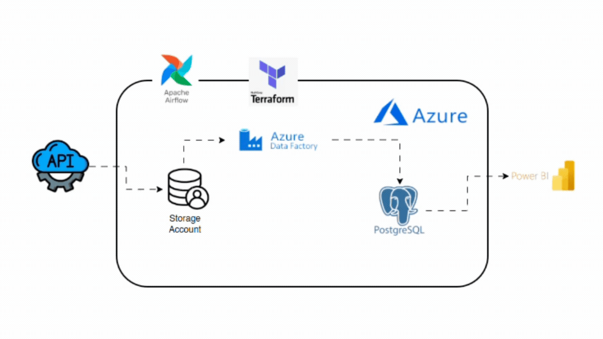
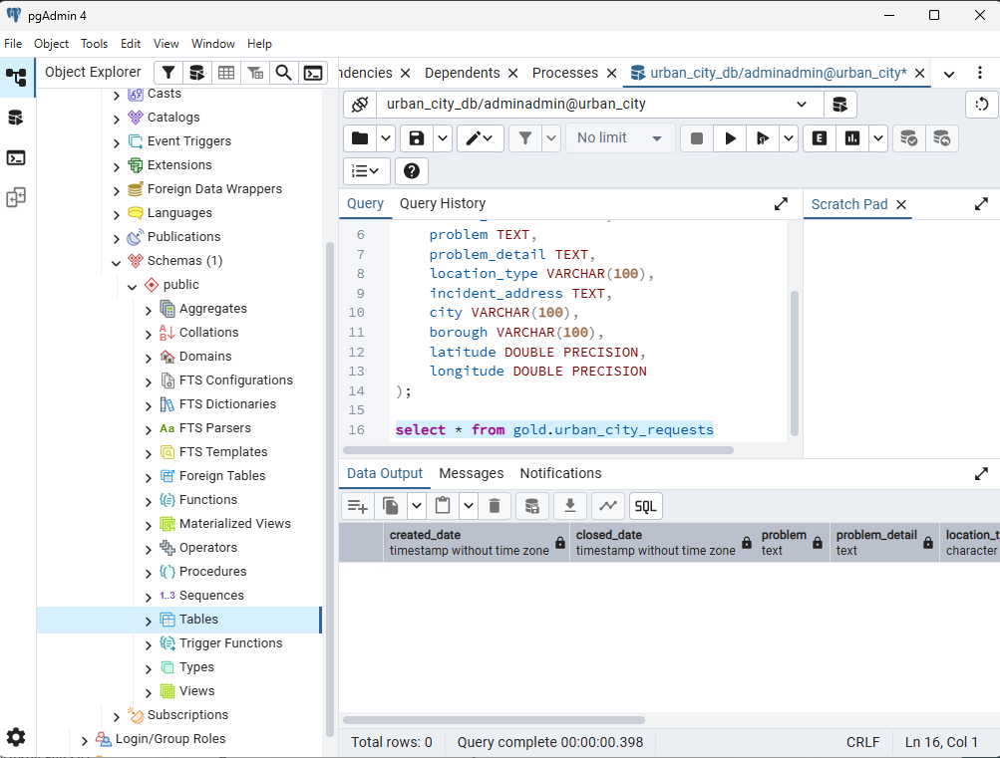
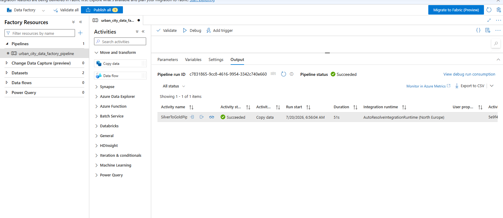
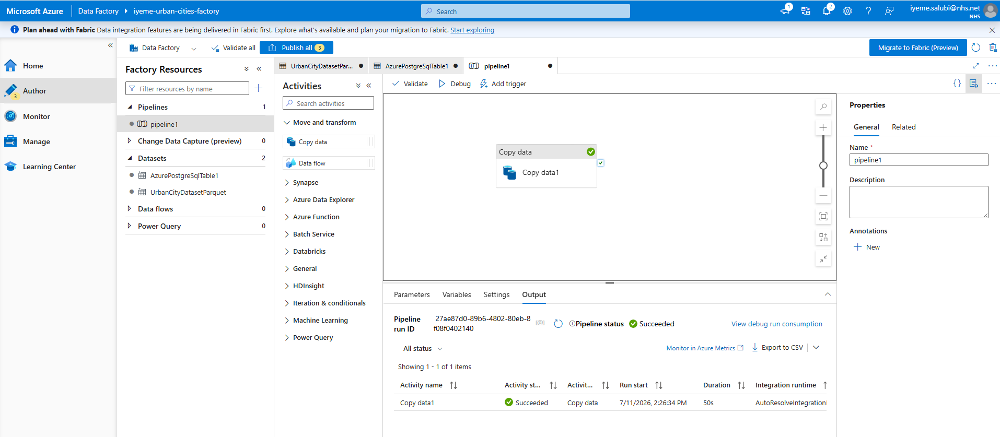
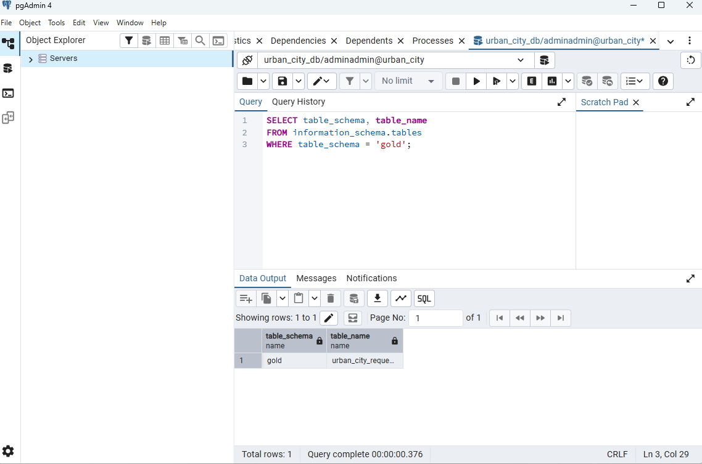
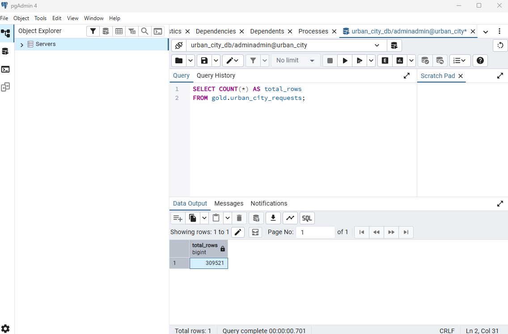

# Public Sector Urban City 311 Service Report

## Background

This project implements an end-to-end batch data engineering pipeline for processing public-sector urban 311 service request data.

The solution demonstrates how raw service-request records can be ingested into Azure Blob Storage, transformed into an analytics-ready format, orchestrated with Apache Airflow, moved into Azure Database for PostgreSQL with Azure Data Factory, and validated with pgAdmin.

The project also uses Terraform to provision core Azure infrastructure and Docker/Astronomer to run Apache Airflow locally in a reproducible environment.

---

## Table of Contents

1. [Project Overview](#project-overview)
2. [Architecture](#architecture)
3. [Tech Stack](#tech-stack)
4. [Data Pipeline Flow](#data-pipeline-flow)
5. [Data Model](#data-model)
6. [Setup and Installation](#setup-and-installation)
7. [Terraform Infrastructure](#terraform-infrastructure)
8. [Azure Blob Storage](#azure-blob-storage)
9. [Data Transformation with Polars](#data-transformation-with-polars)
10. [Airflow Orchestration](#airflow-orchestration)
11. [Azure Data Factory](#azure-data-factory)
12. [PostgreSQL Gold Layer](#postgresql-gold-layer)
13. [Pipeline Validation](#pipeline-validation)
14. [Usage Examples](#usage-examples)
15. [Monitoring and Verification](#monitoring-and-verification)
16. [Troubleshooting](#troubleshooting)
17. [Best Practices](#best-practices)
18. [Key Takeaways](#key-takeaways)
19. [Resources](#resources)
20. [Author](#author)

---

## Project Overview

The project follows a Bronze–Silver–Gold data architecture.

### Key Features

- Infrastructure provisioning with Terraform
- Azure Storage Account with private `bronze` and `silver` containers
- Raw CSV ingestion into Azure Blob Storage
- Data transformation with Python and Polars
- Parquet output compressed with Snappy
- Apache Airflow orchestration with Astronomer
- Docker-based local Airflow environment
- Azure Database for PostgreSQL Flexible Server
- SQL-based creation of the `gold` schema and destination table
- Azure Data Factory Copy activity for Silver-to-Gold movement
- Column mapping and date/time conversion in Data Factory
- Pipeline validation with pgAdmin
- Environment variable management with `.env`
- Git and GitHub for version control

---

## Architecture

### Data Pipeline Architecture



### Architecture Flow

```text
Source CSV
    |
    v
Python / Azure Blob SDK
    |
    v
Azure Blob Storage
Bronze Container
urban_service_requests.csv
    |
    v
Polars Transformation
    |
    v
Azure Blob Storage
Silver Container
urban_service_requests.parquet
    |
    v
Apache Airflow
- Upload raw data
- Transform data
- Create PostgreSQL Gold table
    |
    v
Azure Data Factory
Copy Activity
    |
    v
Azure Database for PostgreSQL
gold.urban_city_requests
    |
    v
pgAdmin / Analytics
```

### Layer Responsibilities

#### Bronze Layer

The Bronze layer stores the raw source data with minimal modification.

```text
bronze/urban_service_requests.csv
```

#### Silver Layer

The Silver layer stores refined and consistently named data in Parquet format.

```text
silver/urban_service_requests.parquet
```

#### Gold Layer

The Gold layer stores the final structured relational dataset in PostgreSQL.

```text
gold.urban_city_requests
```

---

## Tech Stack

| Tool / Service | Purpose |
|---|---|
| Python | Data ingestion and transformation logic |
| Polars | Fast dataframe processing and CSV-to-Parquet transformation |
| Azure Blob Storage | Bronze and Silver data lake layers |
| Azure Storage SDK | Uploading raw data to Azure Blob Storage |
| Apache Airflow | Pipeline orchestration |
| Astronomer Astro CLI | Local Airflow development environment |
| Docker Desktop | Container runtime for local Airflow services |
| Terraform | Infrastructure as Code |
| AzureRM Provider | Provisioning Azure resources |
| AzAPI Provider | Provisioning Data Factory PostgreSQL V2 resources |
| Azure Data Factory | Silver-to-Gold data movement |
| Azure Database for PostgreSQL | Gold-layer relational storage |
| pgAdmin | PostgreSQL administration and data validation |
| Git & GitHub | Version control and project documentation |

---

## Data Pipeline Flow

### 1. Raw Data Ingestion

The source CSV file is read locally by `include/upload_raw_data.py`.

The script connects to Azure Blob Storage with `BlobServiceClient` and uploads:

```text
data/urban_service_requests.csv
```

to:

```text
bronze/urban_service_requests.csv
```

### 2. Transformation

`include/transform.py` reads the Bronze CSV directly from Azure Storage with Polars.

The transformation selects and renames the required columns:

| Raw Column | Refined Column |
|---|---|
| Created Date | `created_date` |
| Closed Date | `closed_date` |
| Problem (formerly Complaint Type) | `problem` |
| Problem Detail (formerly Descriptor) | `problem_detail` |
| Location Type | `location_type` |
| Incident Address | `incident_address` |
| City | `city` |
| Borough | `borough` |
| Latitude | `latitude` |
| Longitude | `longitude` |

The transformed data is written to:

```text
silver/urban_service_requests.parquet
```

using Snappy compression.

### 3. Airflow Orchestration

The Airflow DAG `urban_city_requests` runs the main processing tasks in sequence:

```text
extract_data_from_api
        |
        v
transform_data
        |
        v
urban_city_table
```

The final task uses `SQLExecuteQueryOperator` to create the PostgreSQL `gold` schema and table if they do not already exist.

### 4. Silver-to-Gold Data Movement

Azure Data Factory uses a Copy activity to move the Silver Parquet dataset from Azure Blob Storage into PostgreSQL.

The Data Factory activity maps the Silver fields to the destination PostgreSQL columns and converts source date strings into PostgreSQL timestamps.

### 5. Validation

The completed pipeline is verified by querying the PostgreSQL Gold table with pgAdmin.

A successful test loaded:

```text
309,521 rows
```

into:

```text
gold.urban_city_requests
```

---


## Data Model

The Gold PostgreSQL table is created with:

```sql
CREATE SCHEMA IF NOT EXISTS gold;

CREATE TABLE IF NOT EXISTS gold.urban_city_requests (
    created_date TIMESTAMP,
    closed_date TIMESTAMP,
    problem TEXT,
    problem_detail TEXT,
    location_type VARCHAR(100),
    incident_address TEXT,
    city VARCHAR(100),
    borough VARCHAR(100),
    latitude DOUBLE PRECISION,
    longitude DOUBLE PRECISION
);
```


## Setup and Installation

### 1. Clone the Repository

```bash
git clone https://github.com/iyeme-dev/PUBLIC_SECTOR_URBAN_CITY_311_SERVICE_REPORT.git
cd PUBLIC_SECTOR_URBAN_CITY_311_SERVICE_REPORT
```

### 2. Create a Virtual Environment

```bash
python -m venv environ
```

### 3. Activate the Virtual Environment

PowerShell:

```powershell
.\environ\Scripts\Activate.ps1
```

Git Bash:

```bash
source environ/Scripts/activate
```

### 4. Install Python Dependencies

```bash
python -m pip install -r requirements.txt
```

Core project dependencies include:

```text
polars
azure-storage-blob
python-dotenv
apache-airflow-providers-postgres
apache-airflow-providers-microsoft-azure
```

### 5. Install Required CLIs

Verify Terraform:

```bash
terraform version
```

Verify Astro:

```bash
astro version
```

Verify Azure CLI if used for local Azure authentication:

```bash
az version
```

---

## Terraform Infrastructure

Terraform is used to provision the Azure infrastructure required by the pipeline.

The configuration provisions resources including:

- Azure Resource Group
- Azure Storage Account
- Private Bronze container
- Private Silver container
- Azure Database for PostgreSQL Flexible Server
- PostgreSQL database
- PostgreSQL firewall rule for Azure services
- Azure Data Factory
- Azure Blob Storage linked service
- Parquet dataset
- PostgreSQL V2 linked service
- PostgreSQL dataset

### Terraform Workflow

Navigate to the Terraform directory:

```bash
cd terraform
```

Initialize:

```bash
terraform init
```

Format and validate:

```bash
terraform fmt
terraform validate
```

Review the infrastructure plan:

```bash
terraform plan -var="pg_password=YOUR_PASSWORD"
```

Deploy:

```bash
terraform apply -var="pg_password=YOUR_PASSWORD"
```

### Terraform-Provisioned Storage Account


### Terraform-Provisioned Bronze and Silver Containers


---

## Azure Blob Storage

The Azure Storage Account provides two logical data layers.

```text
bronze
silver
```

The containers are private.

### Bronze

Stores the original CSV:

```text
urban_service_requests.csv
```

### Silver

Stores the transformed Parquet dataset:

```text
urban_service_requests.parquet
```

The Python ingestion code uses the Azure Storage SDK, while Polars reads and writes the Azure paths directly.

---

## Data Transformation with Polars

The transformation layer uses Polars to:

- Read the raw CSV from the Bronze container
- Select only required fields
- Rename verbose source columns to analytics-friendly snake_case names
- Preserve latitude and longitude as numeric values
- Write the result to Parquet
- Apply Snappy compression

Example transformation pattern:

```python
df_refined = df.select([
    pl.col(old).alias(new)
    for old, new in column_mapping.items()
])

df_refined.sink_parquet(
    target_uri,
    storage_options=storage_options,
    compression="snappy"
)
```

---

## Airflow Orchestration

Apache Airflow orchestrates the ingestion, transformation, and Gold-table creation stages.

### Start Airflow Locally

Make sure Docker Desktop is running, then execute:

```bash
astro dev start
```

### Docker Containers

Astro runs the Airflow components in Docker.


### Airflow Started Successfully


### DAG

The main DAG is:

```text
urban_city_requests
```


### Task Sequence

```text
extract_data_from_api
    >>
transform_data
    >>
urban_city_table
```

The first task uploads the source file to the Bronze container.

The second task transforms the Bronze CSV and writes the Silver Parquet file.

The third task executes `dags/sql/urban_city.sql` through the PostgreSQL connection.

### Successful DAG Run


### Airflow Connections

The DAG requires a PostgreSQL connection with the ID:

```text
postgres_conn
```

The Data Factory operator is currently optional in the DAG. In environments where a Microsoft Entra application/service principal is available, it can be enabled to trigger Data Factory automatically. Otherwise, the Data Factory pipeline can be triggered manually from Azure Data Factory Studio.

---

## Azure Data Factory

Azure Data Factory performs the final Silver-to-Gold copy.

### Data Factory Resource


### Source

```text
Azure Blob Storage
Container: silver
File: urban_service_requests.parquet
```

### Destination

```text
Azure Database for PostgreSQL
Database: urban_city_db
Table: gold.urban_city_requests
```


### Manual Silver-to-Gold Pipeline



### Successful Debug Run



### Successful Silver-to-Gold Pipeline


### Copy Activity Details

The verified Data Factory run:

- Read 1 Parquet file
- Read 309,521 rows
- Wrote 309,521 rows
- Copied approximately 138.785 MB from Blob Storage
- Wrote approximately 58.718 MB to PostgreSQL


---

## PostgreSQL Gold Layer

Azure Database for PostgreSQL Flexible Server is used as the final storage layer.

### Azure PostgreSQL Database


### PostgreSQL Endpoint


### Gold Schema Validation

The Gold schema and table can be verified with:

```sql
SELECT table_schema, table_name
FROM information_schema.tables
WHERE table_schema = 'gold';
```



### Validate Row Count

```sql
SELECT COUNT(*) AS total_rows
FROM gold.urban_city_requests;
```

The successful pipeline loaded:

```text
309521
```

records.



### Preview Records

```sql
SELECT *
FROM gold.urban_city_requests
LIMIT 20;
```


### Loaded PostgreSQL Data


---

## Pipeline Validation

The pipeline was validated at multiple stages.

### Infrastructure Validation

Terraform successfully provisioned the cloud resources required for the Azure pipeline.

### Airflow Validation

The Airflow DAG completed:

```text
extract_data_from_api      Success
transform_data             Success
urban_city_table           Success
```

### Data Factory Validation

The Silver-to-Gold Copy activity completed successfully.

### Database Validation

PostgreSQL queries confirmed:

- The `gold` schema exists
- The `urban_city_requests` table exists
- 309,521 rows were loaded
- Records can be queried successfully from pgAdmin

---

## Usage Examples

### 1. Start Docker Desktop

Ensure Docker Desktop is running.

### 2. Start Airflow

```bash
astro dev start
```

### 3. Open Airflow

Use the local URL printed by the Astro CLI.

### 4. Trigger the DAG

In the Airflow UI:

```text
Dags
→ urban_city_requests
→ Trigger
```

### 5. Confirm Airflow Tasks Succeed

Verify:

```text
extract_data_from_api
transform_data
urban_city_table
```

all show `Success`.

### 6. Run Data Factory Manually

In Azure Data Factory Studio:

```text
Author
→ urban_city_data_factory_pipeline
→ Validate
→ Debug
```

For a published manual run:

```text
Publish all
→ Add trigger
→ Trigger now
```

### 7. Verify the Gold Table

```sql
SELECT COUNT(*) AS total_rows
FROM gold.urban_city_requests;
```

### 8. Preview the Data

```sql
SELECT *
FROM gold.urban_city_requests
LIMIT 20;
```

### 9. Stop Airflow

```bash
astro dev stop
```

---

## Monitoring and Verification

### Airflow

Monitor:

- DAG run status
- Individual task states
- Task logs
- Retry attempts
- DAG parsing/import errors

### Azure Data Factory

Monitor:

- Pipeline status
- Activity status
- Rows read
- Rows written
- Data volume
- Copy duration
- Throughput
- Integration Runtime details

### PostgreSQL / pgAdmin

Monitor:

- Gold table existence
- Row count
- Null values
- Data types
- Sample records

Useful checks:

```sql
SELECT COUNT(*)
FROM gold.urban_city_requests;
```

```sql
SELECT COUNT(*) AS open_requests
FROM gold.urban_city_requests
WHERE closed_date IS NULL;
```

```sql
SELECT
    MIN(created_date) AS earliest_request,
    MAX(created_date) AS latest_request
FROM gold.urban_city_requests;
```

---

## Troubleshooting

### Terraform Command Not Found

Verify Terraform is installed and available on `PATH`:

```bash
terraform version
```

### Astro Command Not Found

Verify the Astro CLI:

```bash
astro version
```

On Windows, ensure the Astro executable directory is included in `PATH`.

### Airflow Import Error: Polars Not Found

Add Polars to `requirements.txt` and rebuild the Astro image.

Example:

```text
polars
azure-storage-blob
python-dotenv
```

Then:

```bash
astro dev restart
```

### DAG Import Timeout

Avoid running expensive data operations at module import time.

Keep data processing inside Airflow task functions.

### CSV File Not Found

Confirm the local source file is at:

```text
data/urban_service_requests.csv
```

The source dataset can be too large for normal GitHub storage, so it should be excluded from Git if required.

### Azure Storage Authentication Error

Check:

- Storage account name
- `ACCOUNT_KEY`
- `.env` location
- Container names
- Network/firewall restrictions

### PostgreSQL Connection Error

Check:

- PostgreSQL hostname
- Port `5432`
- Database name
- Username
- Password
- Azure firewall/public network settings
- Airflow `postgres_conn`

### Data Factory Date Conversion Warning

If `created_date` and `closed_date` are strings, configure:

```text
DateTime format: MM/dd/yyyy hh:mm:ss tt
Culture: en-US
```

### Data Factory Cannot Be Triggered from Airflow

The Azure Data Factory Airflow operator requires suitable Azure authentication.

If an Entra app registration/service principal cannot be created because of tenant permissions, run the Data Factory pipeline manually from Azure Data Factory Studio until an approved identity is available.

---

## Best Practices

1. **Keep secrets out of Git**
   - Ignore `.env`, credentials files, `.tfvars`, and secret values.

2. **Use Infrastructure as Code**
   - Manage repeatable Azure infrastructure with Terraform.

3. **Separate data into layers**
   - Bronze for raw data.
   - Silver for refined Parquet.
   - Gold for analytics-ready relational data.

4. **Use Parquet for refined data**
   - Columnar storage and compression reduce storage and transfer overhead.

5. **Use modular Python**
   - Keep upload and transformation logic in separate modules.

6. **Use orchestration**
   - Airflow manages task ordering and failure visibility.

7. **Validate every handoff**
   - Validate Blob upload, Silver output, Data Factory copy, and final PostgreSQL row counts.

8. **Use explicit data types**
   - Convert dates and numeric fields deliberately before loading the destination.

9. **Use least-privilege Azure access**
   - Grant only the permissions required by Terraform, Airflow, and Data Factory.

10. **Review Terraform plans**
    - Always inspect `terraform plan` before `terraform apply`.

---

## Key Takeaways

- Built an end-to-end Azure batch data engineering pipeline for public-sector 311 service requests.
- Implemented Bronze, Silver, and Gold data layers.
- Provisioned Azure infrastructure with Terraform.
- Uploaded raw CSV data to Azure Blob Storage with Python.
- Transformed source data with Polars and stored the refined output as Snappy-compressed Parquet.
- Orchestrated ingestion, transformation, and PostgreSQL table creation with Apache Airflow.
- Ran Airflow locally with Astronomer and Docker.
- Configured Azure Data Factory to copy data from Azure Blob Storage to Azure PostgreSQL.
- Handled string-to-timestamp conversion during the Silver-to-Gold load.
- Successfully loaded and validated 309,521 records in `gold.urban_city_requests`.
- Practiced cloud infrastructure, orchestration, transformation, data movement, database design, and pipeline validation in one project.

---

## Resources

- [Apache Airflow Documentation](https://airflow.apache.org/docs/)
- [Astronomer Documentation](https://www.astronomer.io/docs/)
- [Microsoft Azure Data Factory Documentation](https://learn.microsoft.com/azure/data-factory/)
- [Azure Blob Storage Documentation](https://learn.microsoft.com/azure/storage/blobs/)
- [Azure Database for PostgreSQL Documentation](https://learn.microsoft.com/azure/postgresql/)
- [Terraform AzureRM Provider Documentation](https://registry.terraform.io/providers/hashicorp/azurerm/latest/docs)
- [Terraform AzAPI Provider Documentation](https://registry.terraform.io/providers/Azure/azapi/latest/docs)
- [Polars Documentation](https://docs.pola.rs/)
- [pgAdmin Documentation](https://www.pgadmin.org/docs/)
- [Docker Documentation](https://docs.docker.com/)

---

## Author

**Iyeme Salubi**

GitHub: [iyeme-dev](https://github.com/iyeme-dev)
